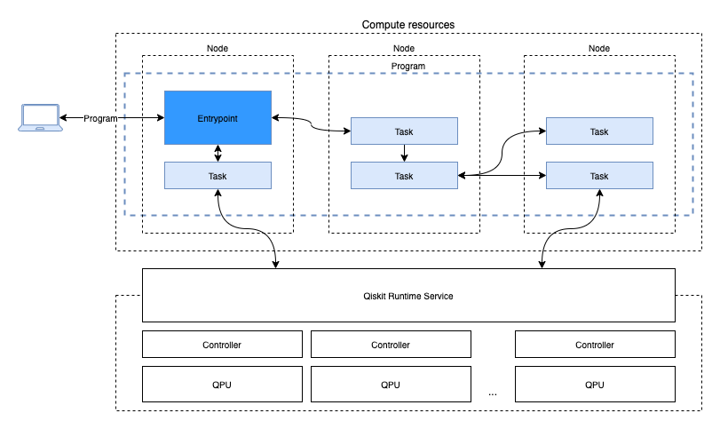

[](https://github.com/Qiskit-Extensions/quantum-serverless/releases)
[](https://github.com/qiskit-community/quantum-prototype-template/blob/main/LICENSE.txt)
[](https://github.com/psf/black)
[](https://www.python.org/)
[](https://github.com/Qiskit/qiskit)

# Quantum serverless



### Table of Contents

1. [Installation](INSTALL.md)
2. [Quickstart](#quickstart-guide)
3. [Beginners Guide](docs/beginners_guide.md)
4. Modules:
   1. [Client](./client)
   2. [Infrastructure](./infrastructure)
5. [Tutorials](docs/tutorials/)
6. [Guides](docs/guides/)
7. [How to Give Feedback](#how-to-give-feedback)
8. [Contribution Guidelines](#contribution-guidelines)
9. [References and Acknowledgements](#references-and-acknowledgements)
10. [License](#license)

----------------------------------------------------------------------------------------------------

### Quickstart

Steps
1. prepare infrastructure
2. write your program
3. run program

#### Prepare infrastructure

In the root folder of this project you can find `docker-compose.yml` 
file, which is configured to run all necessary services for quickstart tutorials.

Run in a root folder
```shell
docker-compose pull
docker-compose up
```

:memo: For more advanced ways to deploy the project you have the guide:
[Multi cloud deployment](https://qiskit-extensions.github.io/quantum-serverless/guides/08_multi_cloud_deployment.html).

#### Write your program

Create python file with necessary code. Let's call in `program.py`

```python
# program.py
from qiskit import QuantumCircuit
from qiskit.circuit.random import random_circuit
from qiskit.quantum_info import SparsePauliOp
from qiskit.primitives import Estimator

from quantum_serverless import QuantumServerless, run_qiskit_remote, get, put
from quantum_serverless.core.state import RedisStateHandler

# 1. let's annotate out function to convert it
# to function that can be executed remotely
# using `run_qiskit_remote` decorator
@run_qiskit_remote()
def my_function(circuit: QuantumCircuit, obs: SparsePauliOp):
    return Estimator().run([circuit], [obs]).result().values


# 2. Next let's create out serverless object to control
# where our remote function will be executed
serverless = QuantumServerless()

# 2.1 (Optional) state handler to write/read results in/out of job
state_handler = RedisStateHandler("redis", 6379)

circuits = [random_circuit(2, 2) for _ in range(3)]

# 3. create serverless context
with serverless:
    # 4. let's put some shared objects into remote storage that will be shared among all executions
    obs_ref = put(SparsePauliOp(["ZZ"]))

    # 4. run our function and get back reference to it
    # as now our function it remote one
    function_reference = my_function(circuits[0], obs_ref)

    # 4.1 or we can run N of them in parallel (for all circuits)
    function_references = [my_function(circ, obs_ref) for circ in circuits]

    # 5. to get results back from reference
    # we need to call `get` on function reference
    single_result = get(function_reference)
    parallel_result = get(function_references)
    print("Single execution:", single_result)
    print("N parallel executions:", parallel_result)

    # 5.1 (Optional) write results to state.
    state_handler.set("result", {
        "status": "ok",
        "single": single_result.tolist(),
        "parallel_result": [entry.tolist() for entry in parallel_result]
    })
```

#### Run program

Let's run our program now

```python
from quantum_serverless import QuantumServerless, Program
from quantum_serverless.core.state import RedisStateHandler

serverless = QuantumServerless({
    "providers": [{
        "name": "docker-compose",
        "compute_resource": {
            "name": "docker-compose",
            "host": "localhost", # using our docker-compose infrastructure
        }
    }]
})
serverless.set_provider("docker-compose") # set provider as docker-compose

state_handler = RedisStateHandler("localhost", 6379)

# create out program
program = Program(
    name="my_program",
    entrypoint="program.py" # set entrypoint as our program.py file
)

job = serverless.run_program(program)

job.status()
# <JobStatus.SUCCEEDED: 'SUCCEEDED'>

job.logs()
# Single execution: [1.]
# N parallel executions: [array([1.]), array([0.]), array([-0.28650496])]

state_handler.get("result") # (Optional) get written data
# {'status': 'ok',
# 'single': [1.0],
# 'parallel_result': [[1.0], [0.0], [-0.28650496]]}
```


----------------------------------------------------------------------------------------------------

### How to Give Feedback

We encourage your feedback! You can share your thoughts with us by:
- [Opening an issue](https://github.com/Qiskit-Extensions/quantum-serverless/issues) in the repository


----------------------------------------------------------------------------------------------------

### Contribution Guidelines

For information on how to contribute to this project, please take a look at our [contribution guidelines](CONTRIBUTING.md).

----------------------------------------------------------------------------------------------------

### Deprecation Policy

This project is meant to evolve rapidly and, as such, do not follow [Qiskit's deprecation policy](https://qiskit.org/documentation/contributing_to_qiskit.html#deprecation-policy).  We may occasionally make breaking changes in order to improve the user experience.  When possible, we will keep old interfaces and mark them as deprecated, as long as they can co-exist with the new ones.  Each substantial improvement, breaking change, or deprecation will be documented in release notes.


----------------------------------------------------------------------------------------------------

## References and Acknowledgements
[1] Qiskit Terra \
    https://github.com/Qiskit/qiskit-terra

[2] Client for IBM Qiskit Runtime \
    https://github.com/Qiskit/qiskit-ibm-runtime


----------------------------------------------------------------------------------------------------

### License
[Apache License 2.0](LICENSE.txt)
